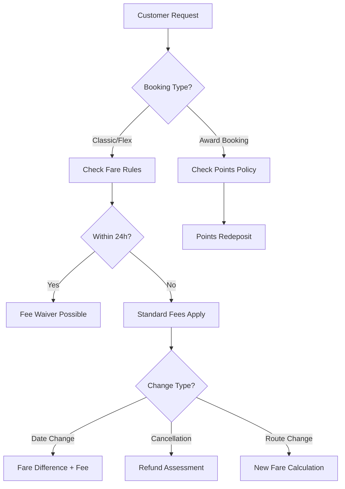
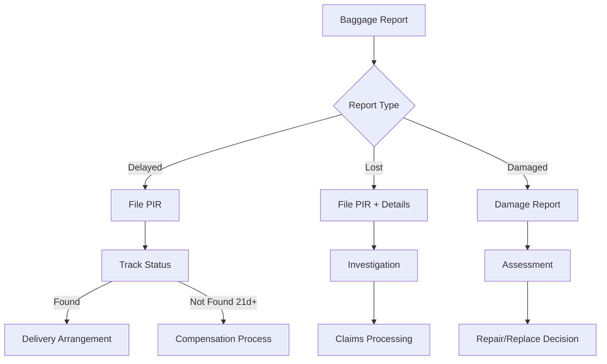
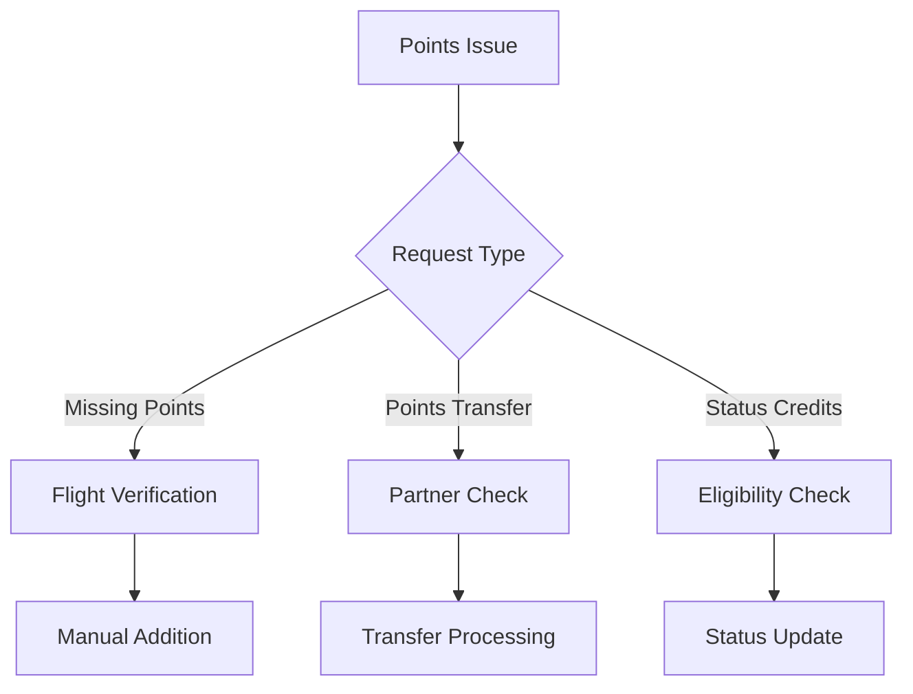
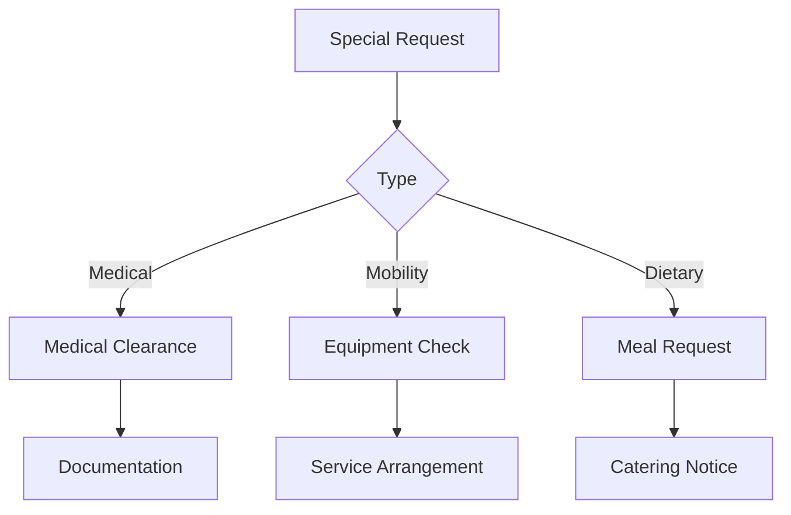
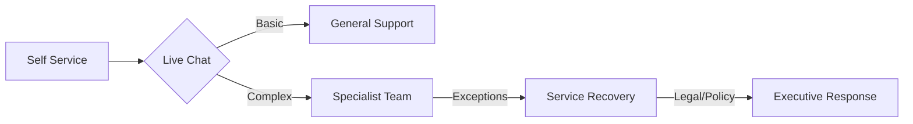

# Qantas Support Workflows

# Common Support Scenarios

## 1. Booking Changes & Refunds

### Initial Assessment
1. **Verify Booking Details**
   - Booking reference
   - Passenger names
   - Flight details
   - Fare type/conditions

2. **Change Type Classification**
   - Voluntary change
   - Flight cancellation
   - Schedule change
   - COVID-19 related
   - Other disruptions

### Change/Refund Workflow

### Processing Steps
1. **Date Changes**
   - Check new flight availability
   - Calculate fare difference
   - Apply change fee if applicable
   - Process payment/refund
   - Send confirmation

2. **Cancellations**
   - Check refund eligibility
   - Calculate refund amount
   - Process refund to original form
   - Update Frequent Flyer points
   - Send confirmation

3. **Route Changes**
   - Check new route availability
   - Recalculate fare and taxes
   - Process additional payment
   - Update itinerary
   - Send confirmation

## 2. Baggage Services

### Lost/Delayed Baggage

### Processing Steps
1. **Initial Report**
   - File Property Irregularity Report (PIR)
   - Collect contact details
   - Get baggage description
   - Record contents value

2. **Tracking & Updates**
   - Regular status updates
   - Delivery coordination
   - Compensation processing
   - Claims assessment

3. **Resolution**
   - Arrange delivery
   - Process compensation
   - Close case
   - Customer follow-up

## 3. Frequent Flyer Services

### Points Management

### Common Processes
1. **Missing Points Claims**
   - Verify flight details
   - Check eligibility
   - Process points
   - Send confirmation

2. **Status Credits**
   - Review qualifying flights
   - Calculate credits
   - Update status
   - Notify member

## 4. Special Assistance

### Request Workflow

### Processing Steps
1. **Medical Assistance**
   - Review medical documentation
   - Arrange special equipment
   - Update passenger record
   - Brief ground staff

2. **Mobility Assistance**
   - Arrange wheelchair/equipment
   - Update booking
   - Coordinate airport services
   - Brief cabin crew

3. **Dietary Requirements**
   - Record requirements
   - Notify catering
   - Confirm availability
   - Update passenger record

## Primary Interaction Points
1. **Pre-flight** (60%):
   - Booking modifications
   - Special requests
   - Seat selection
   - Meal preferences

2. **Post-flight** (30%):
   - Baggage claims
   - Feedback resolution
   - Missing points

3. **Loyalty** (10%):
   - Point management
   - Status benefits
   - Partner inquiries

## Escalation Protocol

## Cultural Handling
- **Indigenous Australian Protocols**:
  - Acknowledgement of Country
  - Sensitivity to cultural artifacts
  - Respect for Sorry Business

- **APAC Service Norms**:
  - Formal honorifics (Mr/Ms)
  - Indirect conflict resolution
  - Face-saving communication
  - Regional holiday awareness

## Service Recovery Steps
1. **Acknowledge**
   - Listen actively
   - Express understanding
   - Note booking details

2. **Assess**
   - Review fare rules
   - Check eligibility
   - Calculate costs

3. **Action**
   - Process changes
   - Apply waivers if eligible
   - Document decisions

4. **Advise**
   - Explain outcome
   - Provide alternatives
   - Confirm next steps
