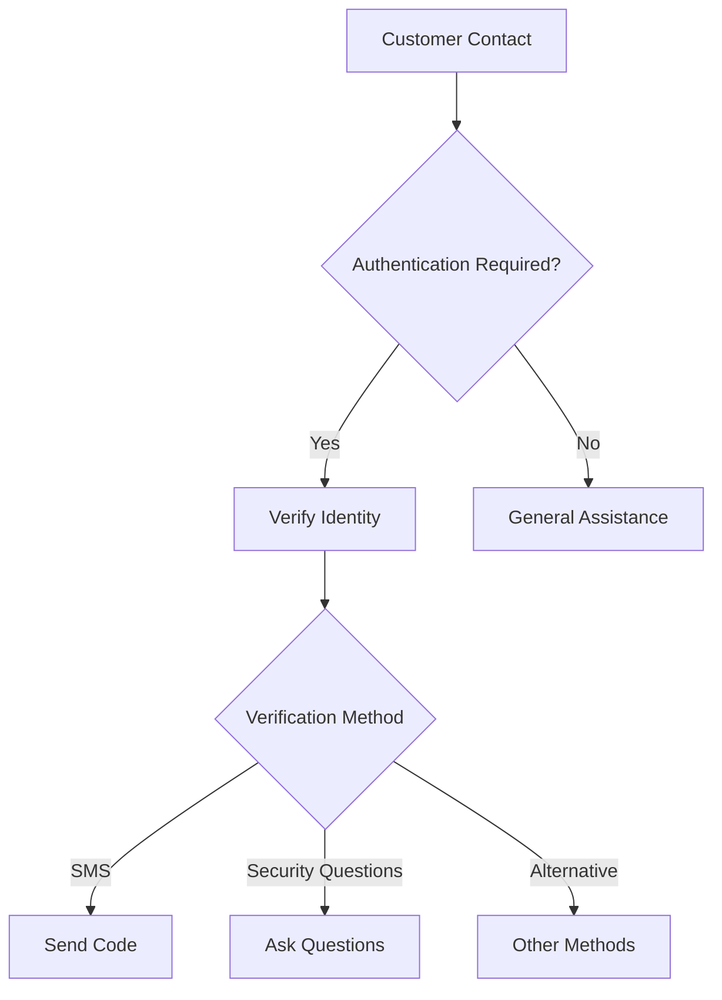
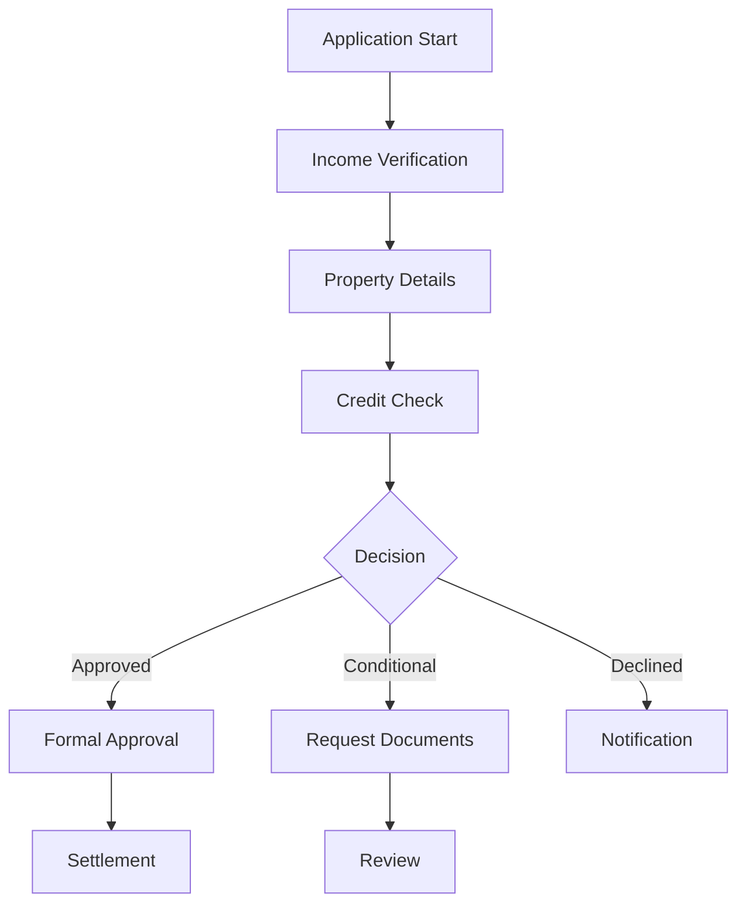
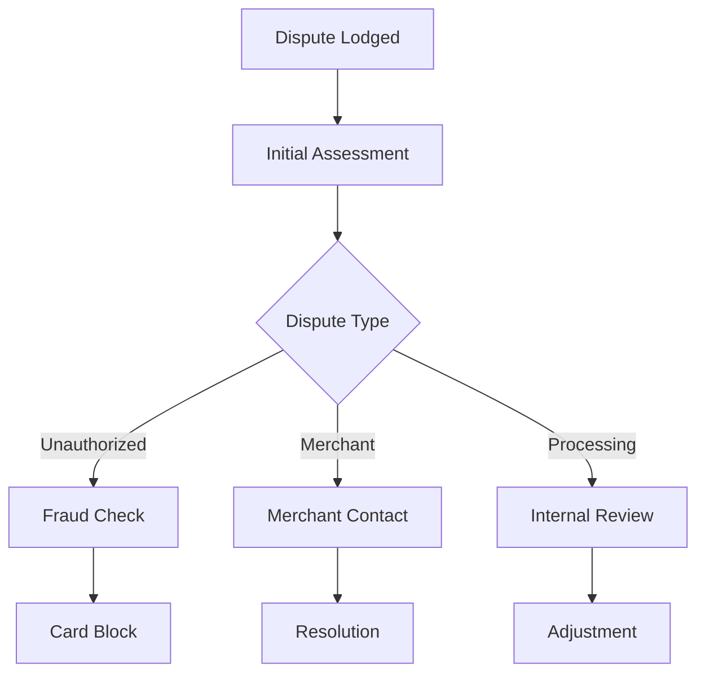
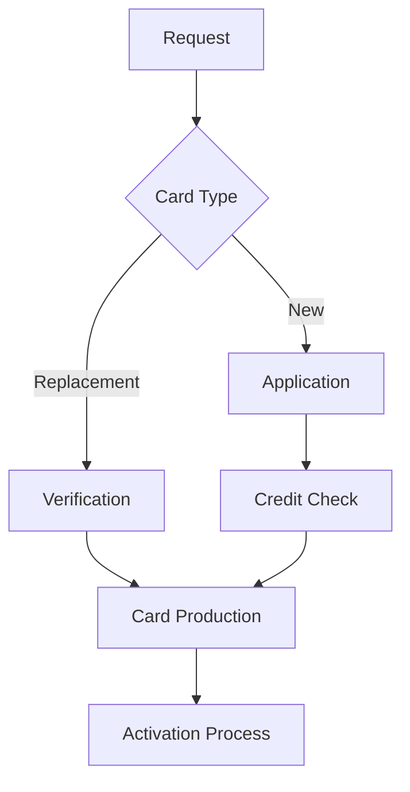
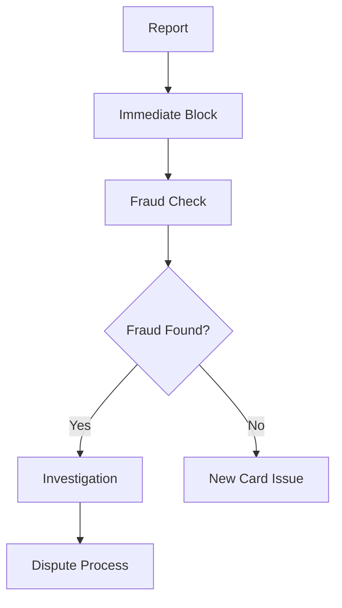
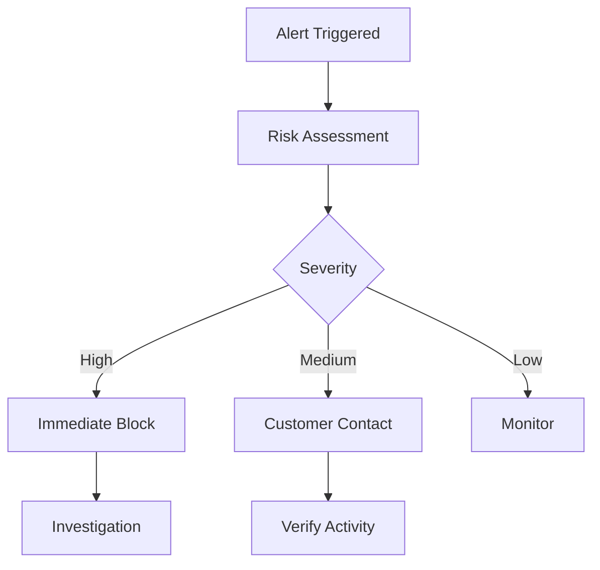
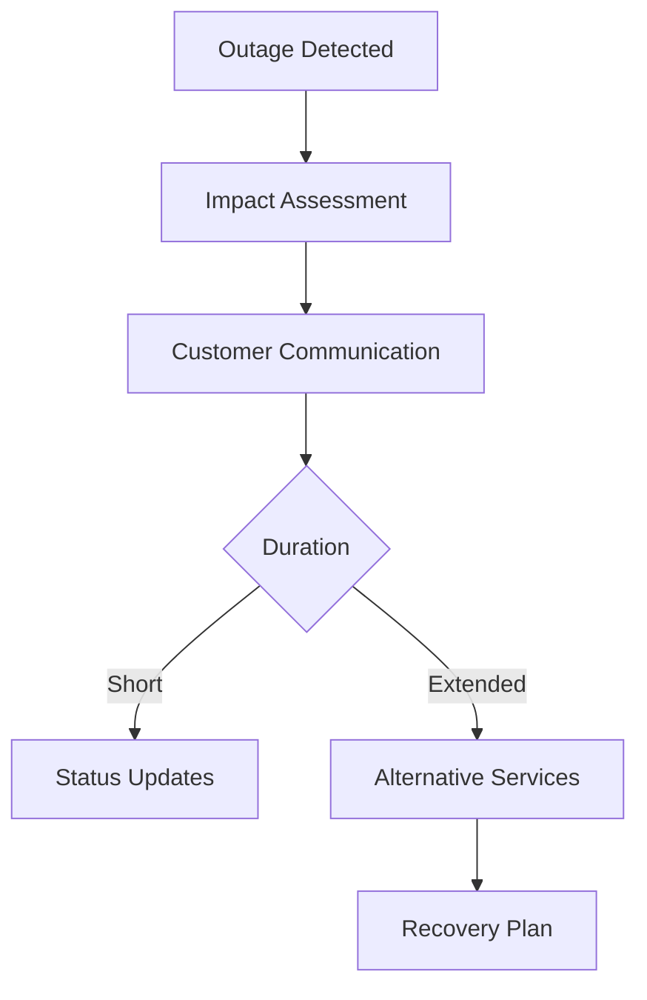
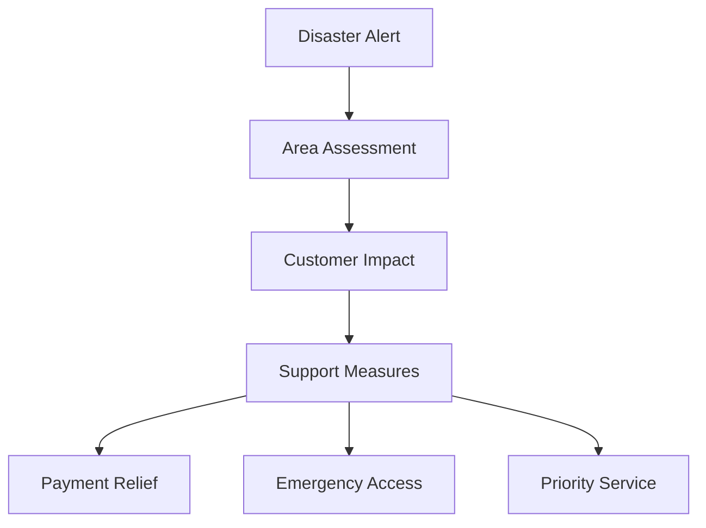
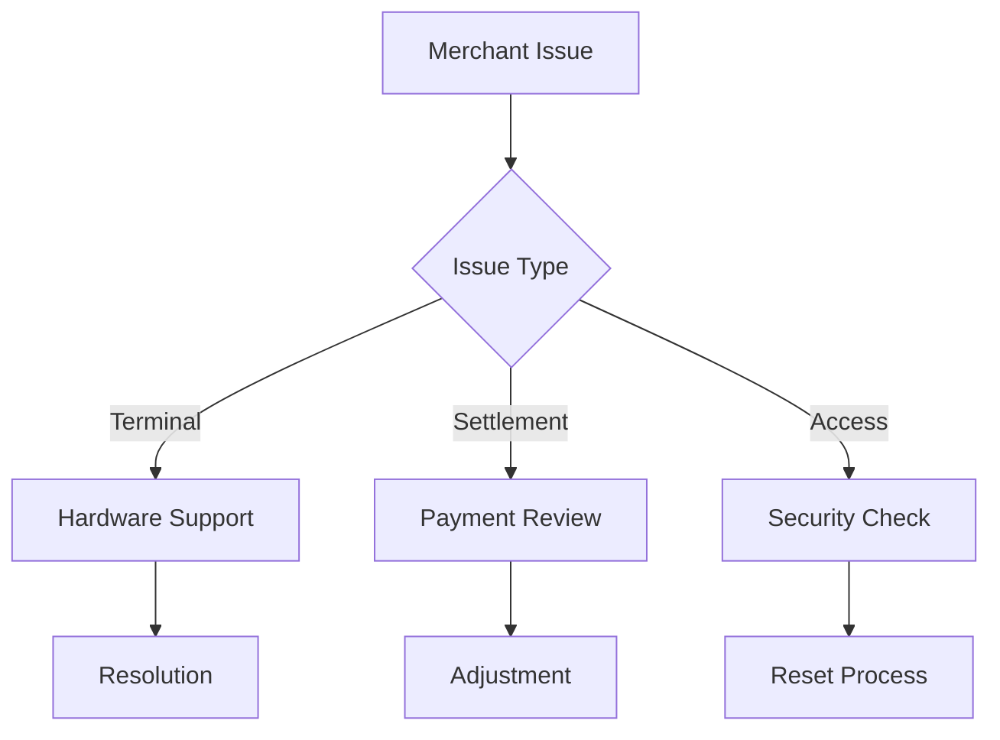
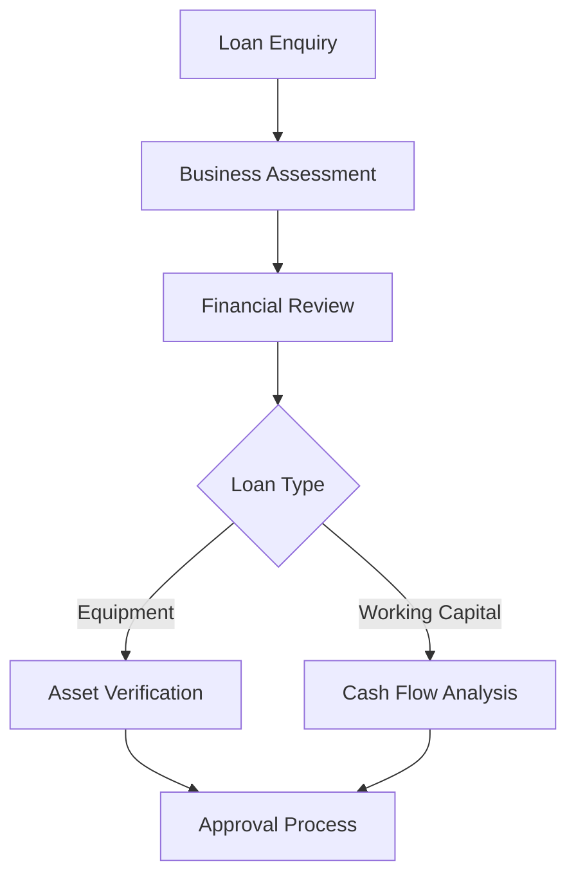

# Westpac Service Workflows

## 1. Customer Authentication Flow

### Initial Contact


### Verification Process
1. Request Customer ID
   - If not available, use alternative verification
   - Explain why verification is needed

2. Two-Factor Authentication
   ```
   if (registered_mobile) {
       offer_sms_code()
   } else if (security_questions_set) {
       use_security_questions()
   } else {
       escalate_to_specialist()
   }
   ```

## 2. Loan Application Process

### Home Loan Application


### Processing Steps
1. Initial Assessment
   - Income verification
   - Expense analysis
   - Property valuation
   - Credit check

2. Documentation
   - Proof of income
   - Bank statements
   - Property documents
   - ID verification

3. Approval Process
   - Initial assessment
   - Formal approval
   - Conditional approval
   - Final settlement

## 3. Dispute Resolution

### Transaction Dispute


### Processing Steps
1. Dispute Intake
   - Transaction details
   - Dispute reason
   - Evidence collection
   - Temporary credit assessment

2. Investigation
   - Merchant contact
   - Documentation review
   - Scheme rules check
   - Customer communication

3. Resolution
   - Outcome determination
   - Customer notification
   - Account adjustment
   - Prevention advice

## 4. Card Management

### New Card Issuance


### Lost/Stolen Card


## 5. Emergency Response

### Fraud Detection


### System Outage


### Natural Disaster Response


## 6. Business Banking Support

### Merchant Services


### Business Lending


## Emotional State Management

### Distressed Customer
1. Acknowledge emotion
2. Show empathy
3. Take control professionally
   ```
   if (customer_frustrated) {
       acknowledge_frustration()
       offer_immediate_assistance()
   } else if (customer_worried) {
       provide_reassurance()
       explain_security_measures()
   }
   ```

### Satisfaction Check
1. Confirm resolution
2. Address additional concerns
3. Thank customer
   ```
   if (fully_resolved) {
       confirm_satisfaction()
       offer_additional_help()
   } else {
       explain_next_steps()
       set_follow_up()
   }
   ```

## Cultural Support Protocols

### Indigenous Australian Customers
1. Acknowledge Traditional Owners
2. Offer interpreter services
3. Explain financial assistance programs
4. Provide dedicated Indigenous banking team contact

```
if (customer_identifies_as_indigenous) {
    offer_cultural_support_options()
}
```

### Remote Community Banking
1. Identify regional accessibility needs
2. Offer Bank@Post alternatives
3. Provide satellite banking schedules
4. Explain cash delivery services

```
if (postcode in remote_areas) {
    activate_regional_support_mode()
}
```

## Escalation Procedures

### When to Escalate
- Complex financial advice needed
- Technical issues beyond scope
- Complaint handling
- Fraud cases

### Escalation Process
1. Explain need for escalation
2. Set expectations
3. Warm transfer when possible
   ```
   if (specialist_available) {
       perform_warm_transfer()
   } else {
       schedule_callback()
       provide_case_number()
   }
   ```

## Quality Assurance Checkpoints

### During Interaction
- Verify understanding
- Confirm actions
- Document decisions
   ```
   after_each_step {
       confirm_understanding()
       document_action()
       verify_next_steps()
   }
   ```

### Post-Interaction
1. Summarize actions taken
2. Confirm no other needs
3. Document interaction
   ```
   before_closing {
       summarize_resolution()
       offer_additional_assistance()
       complete_documentation()
   }
   ```
